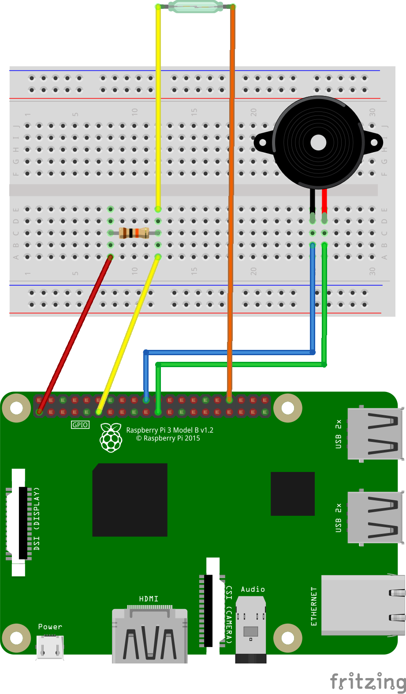

# door-monitor

## About

This program uses a reed sensor to monitor the status of the door (open/closed)
and in case of status change an email is send.

## Software

Developed using the [Wiring Pi](http://wiringpi.com/) GPIO interface library.

## Hardware

 - Raspberry Pi 3 Model B Rev 1.2
 - Reed switch
 - 10kΩ (kohm) resistor
 - Jumper wires

## Breadboard view



## Configuration

Edit ```door-sendmail.sh``` and modify the values of ```TO```, ```FROM```,
```SUBJECT``` and ```CONTENT``` variables as you wish.

## Installation/Uninstallation

```bash
root@rpi3 ~ $ cd wiringpi-projects/door-monitor
root@rpi3 ~ $ make            # Compile door-monitor.c to door-monitor.elf
root@rpi3 ~ $ make install    # Install the .elf file under /root/bin/
root@rpi3 ~ $ make uninstall  # Remove the .elf file from /root/bin/
root@rpi3 ~ $ make clean      # Remove the .elf file from current dir
```

The ```make``` and ```make install``` targets will respectively compile ```door-monitor.c```
and install ```door-monitor.elf``` (compilation product) and ```door-sendmail.sh``` under
```/root/bin/```. In case you want to choose a different directory modify
the content of variable ```TARGETDIR``` in ```Makefile```.

## Setting up the mail server

First of all install the required packages by running the command below:
```bash
apt-get install mailutils ssmtp
```

Then edit file ```/etc/ssmtp/ssmtp.conf``` and modify it so that its contents look like this:

```bash
#
# Config file for sSMTP sendmail
#
# The person who gets all mail for userids < 1000
# Make this empty to disable rewriting.
root=postmaster

# The place where the mail goes. The actual machine name is required no 
# MX records are consulted. Commonly mailhosts are named mail.domain.com
mailhub=smtp.server.xz:port

# Where will the mail seem to come from?
#rewriteDomain=

# The full hostname
hostname=your-pi's-hostname

# Are users allowed to set their own From: address?
# YES - Allow the user to specify their own From: address
# NO - Use the system generated From: address
FromLineOverride=YES
AuthUser=user@server.xz
AuthPass=secret-password
UseSTARTTLS=YES
```

*Important*: Make sure to modify lines ```mailhub```, ```hostname```, ```AuthUser```, ```AuthPass``` at your discretion. For Gmail set ```mailhub=smtp.gmail.com:587```

## Execution using Crontab

`Crontab` allows you to automatically execute a comand or a shell script at given intervals.

Run `crontab -e` to edit current crontab file. The very first time you will be prompted to choose the editor of your choice.

Assuming that you didn't modify the installation dir, add the following entry at the end of the file:
```bash
@reboot /root/bin/door-monitor.elf
```
in order for ```door-monitor.elf``` to be executed every time the raspberry pi boots. Save changes and exit.

